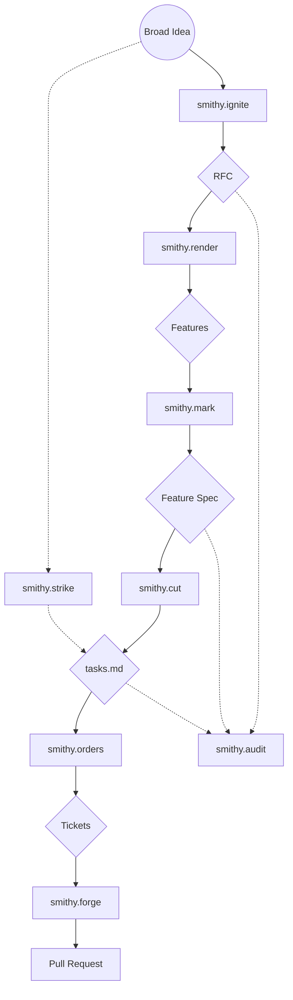

# Smithy CLI

Stop hand-crafting the same RFC → spec → tasks → PR scaffolding for every AI-assisted change. **Smithy** installs a structured pipeline of slash commands — `/smithy.ignite`, `/smithy.render`, `/smithy.mark`, `/smithy.cut`, `/smithy.forge`, plus the `/smithy.strike` fast track — into your repo so Claude Code, Gemini CLI, or Codex can drive it. One `smithy init` deploys the same prompts, permissions, and skills across every supported assistant.

## Installation

You can run Smithy directly via `npx` (recommended):

```bash
npx @balexda/smithy init
```

Or install it globally:

```bash
npm install -g @balexda/smithy
smithy init
```

## Supported AI Assistants

- **Claude:** Installs commands, prompts, and sub-agents into `.claude/` for use within your Claude Code workflows.
- **Gemini CLI:** Installs workspace skills (`.gemini/skills/`) so you can type `/skills reload` and immediately use Smithy workflow commands.
- **Codex:** Installs project skills into `.agents/skills/` and reference prompts into `tools/codex/prompts/`, with `smithy.forge` and `smithy.fix` ready for Codex-driven implementation and repair workflows.

## Planning Artifact Storage

`smithy init` asks where Smithy planning artifacts (RFCs, specs, tasks, strikes, PRDs) should live. Pick the mode that fits your team — the choice is persisted in the manifest, round-tripped by `smithy update`, and baked into the deployed prompts so your AI assistant always writes to the right place:

- **Repo** (default): artifacts are committed in-tree under `docs/rfcs/`, `docs/prds/`, `specs/`, `specs/strikes/`, etc. Choose this when planning artifacts should live with the code and show up in PRs.
- **External**: artifacts are written out-of-tree under your home directory, keeping planning files off the team's git history.

You can also set it non-interactively with `--artifacts-location repo|external` on `init`/`update`.

### External layout

External artifacts are stored under a fixed, repo-keyed root:

```
~/.smithy/repos/<repoKey>/        # then docs/rfcs/, docs/prds/, specs/, specs/strikes/ underneath
```

- `repos/` is a fixed grouping segment that isolates per-repo stores from Smithy's own files in `~/.smithy/` (`templates/`, `smithy-manifest.json`, `config.yml`). It's collision-proof: a repo literally named `templates` resolves to `~/.smithy/repos/templates/`, never clobbering `~/.smithy/templates/`.
- `<repoKey>` is **worktree-stable**. It's derived from git's shared git-common-dir (`git rev-parse --git-common-dir`) rather than the working-directory name, so every linked worktree of a repo *and* its main checkout resolve to the same key and share one store. `smithy status` therefore reports identical, repo-keyed paths no matter which worktree you run it from. When git can't identify the repo, Smithy falls back to the `origin` remote name, then the directory name. The key is always sanitized to a single filesystem-safe path segment.

## Workflow Industrial Pipeline

The Smithy Industrial Pipeline follows a structured path from broad ideas to verified implementations, incorporating "Fast Track" shortcuts and built-in "Review Loops" at every stage.

### The Pipeline Stages

| Stage | Agent | Purpose |
| :--- | :--- | :--- |
| **Ideation** | `smithy.ignite` | **Spark**: Workshop a broad idea into a structured RFC. |
| **Rendering** | `smithy.render` | **Render**: Break an RFC milestone into features. |
| **Planning** | `smithy.mark` | **Scope**: Specify a feature with spec, data model, and contracts. |
| **Cutting** | `smithy.cut` | **Cut**: Slice a user story into PR-sized task slices. |
| **Ordering** | `smithy.orders` | **Order**: Create tickets from Smithy artifacts. |
| **Forging** | `smithy.forge` | **Stage**: Implement a slice and forge a PR. |
| **Repair** | `smithy.fix` | **Fix**: Diagnose and fix errors from CI failures, test failures, or bugs. |
| **Shortcut** | `smithy.strike` | **Direct**: Strike while the iron is hot (Idea -> Tasks). |
| **Review** | `smithy.audit` | **Audit**: Universal auditor for any Smithy artifact. |

### Pipeline Diagram



## Contributing

See [CONTRIBUTING.md](CONTRIBUTING.md) for development setup, testing strategy, and pre-release checklist.
