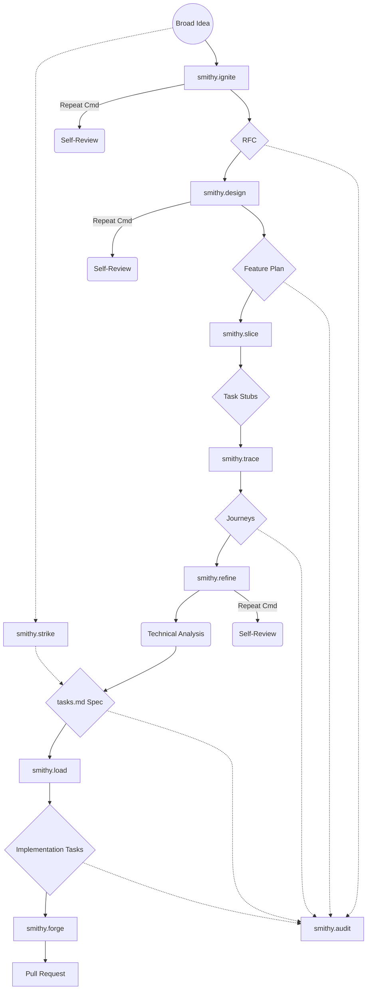

# Smithy CLI

An initialization tool for the **Smithy Agentic Development Workflow**. This package provides a CLI that easily sets up the `smithy` prompt templates for various AI assistant workflows, including Gemini CLI, Claude, and Codex.

## Installation

You can run Smithy directly via `npx` (recommended):

```bash
npx smithycli init
```

Or install it globally:

```bash
npm install -g smithycli
smithy init
```

## Supported AI Assistants

- **Gemini CLI:** Installs workspace skills (`.gemini/skills/`) so you can type `/skills reload` and immediately use `/skill smithy-scope` and other workflow commands.
- **Claude:** Installs prompts into `.claude/prompts/` to use within your Claude-based workflows.
- **Codex:** Sets up prompts in `tools/codex/prompts/` for the original `spec-kit` and Codex workflows.

## Workflow Industrial Pipeline

The Smithy Industrial Pipeline follows a structured path from broad ideas to verified implementations, incorporating "Fast Track" shortcuts and built-in "Review Loops" at every stage.

### The Pipeline Stages

| Stage | Agent | Purpose |
| :--- | :--- | :--- |
| **Ideation** | `smithy.ignite` | **Spark**: Workshop a broad idea into a structured RFC. |
| **Planning** | `smithy.design` | **Scope**: Transform an RFC into a Feature Plan. |
| **Breakdown** | `smithy.slice` | **Segment**: Slice a Feature Plan into Task Stubs. |
| **Mapping** | `smithy.trace` | **Flowmap**: Map a Task Stub into an Experience Journey. |
| **Technical** | `smithy.refine` | **Detail**: Turn a Journey into a `tasks.md` spec (Analyze -> Plan -> Tasks). |
| **Queuing** | `smithy.load` | **Queue**: Load Implementation Tasks into GitHub. |
| **Forging** | `smithy.forge` | **Stage**: Implement a phase and forge a PR. |
| **Repair** | `smithy.fix` | **Fix**: Diagnose and fix errors from CI failures, test failures, or bugs. |
| **Shortcut** | `smithy.strike` | **Direct**: Strike while the iron is hot (Idea -> Tasks). |
| **Review** | `smithy.audit` | **Audit**: Universal auditor for any Smithy artifact. |

### Visualization



## Contributing

To build the tool locally:

```bash
npm install
npm run build
node dist/cli.js init
```
