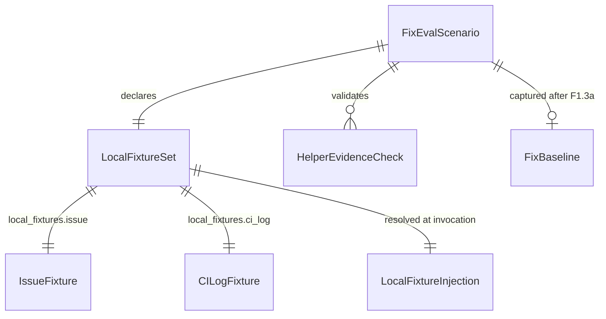
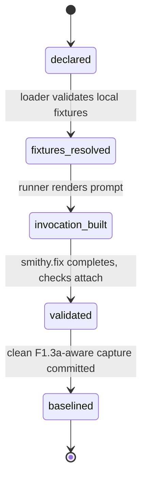
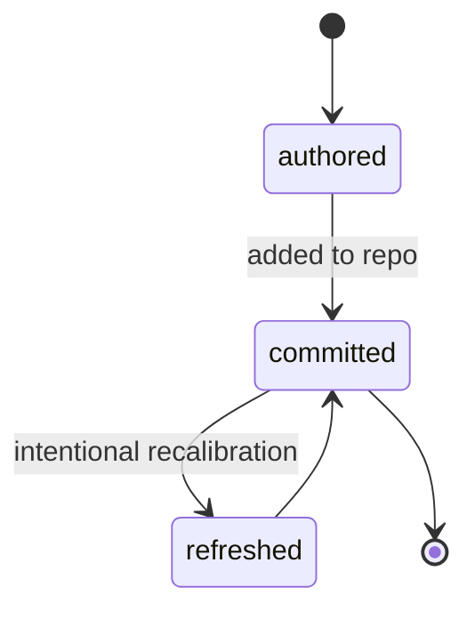

# Data Model: smithy.fix End-to-End Eval Scenario

## Overview

This feature adds data definitions for a deterministic smithy.fix eval scenario. The model extends scenario metadata with local fixture declarations, introduces committed issue and CI-log fixtures as repository artifacts, and consumes the token-aware baseline shape established by Feature 1.3a. No persistent database or external storage is introduced.

## Entities

### 1) Fix Eval Scenario (`fix_eval_scenario`)

Purpose: Represents the YAML scenario that invokes smithy.fix against offline failure evidence.

| Field | Type | Required | Notes |
|-------|------|----------|-------|
| `name` | string | Yes | Stable scenario name. Expected value is `fix-from-issue`. |
| `skill` | string | Yes | Smithy command under test. Expected value is `/smithy.fix`. |
| `prompt` | string | Yes | Scenario prompt template that references the local fixture evidence exposed by the runner. |
| `local_fixtures` | LocalFixtureSet | Conditional | Optional at the scenario-schema level (scenarios without local evidence omit it and remain compatible, per contracts.md §1); required for this `fix-from-issue` scenario, which declares the issue and CI-log fixture files it needs. |
| `structural_expectations` | StructuralExpectations | Yes | Existing eval validation contract for required headings, patterns, tables, and forbidden patterns. |
| `sub_agent_evidence` | HelperEvidenceCheck[] | No | Expected helper evidence for the observed smithy.fix path. |
| `timeout` | integer | No | Existing per-scenario timeout override in seconds. |

Validation rules:

- `name`, `skill`, and `prompt` must be non-empty strings.
- `skill` must resolve to the deployed smithy.fix command.
- `local_fixtures` is optional at the scenario-schema level; when absent the scenario loads without fixture injection (contracts.md §1). It is required for the `fix-from-issue` scenario.
- When `local_fixtures` is present, `local_fixtures.issue` and `local_fixtures.ci_log` must resolve under the allowed eval fixture area.
- Structural expectations must include at least one stable marker for diagnosis, fix action, and verification output.
- Helper evidence is optional. It is populated for the committed smithy.fix scenario only when the captured run actually dispatches helper agents; if the observed offline error-description path dispatches none, `sub_agent_evidence` is empty or omitted and the scenario must not fail for lack of helper checks.

### 2) LocalFixtureSet (`local_fixture_set`)

Purpose: Declares the local evidence files the runner makes available to the scenario invocation.

| Field | Type | Required | Notes |
|-------|------|----------|-------|
| `issue` | string | Yes | Repository-relative path to the offline issue fixture. |
| `ci_log` | string | Yes | Repository-relative path to the offline CI-log fixture. |

Validation rules:

- Paths must be relative repository paths.
- Paths must not contain parent-directory segments or absolute-path syntax.
- `issue` must point under `evals/fixture/issues/`.
- `ci_log` must point under `evals/fixture/ci-logs/`.
- Each path must resolve to a readable file before the scenario invocation is built.

### 3) Issue Fixture (`issue_fixture`)

Purpose: Provides deterministic issue or CI-failure context for smithy.fix without `gh issue view`.

| Field | Type | Required | Notes |
|-------|------|----------|-------|
| `path` | string | Yes | Repository-relative Markdown fixture path. |
| `title` | string | Yes | Human-readable problem title embedded in the fixture. |
| `body` | markdown | Yes | Bug report or CI-failure description with enough context to drive diagnosis. |
| `referenced_files` | string[] | No | Source or test files named by the fixture text. |

Validation rules:

- The fixture file must be UTF-8 text.
- The fixture must include a concrete failure description.
- Referenced files should exist in the eval fixture copy or be intentionally absent as part of the tested failure.

### 4) CI Log Fixture (`ci_log_fixture`)

Purpose: Provides deterministic failing build or test output for the smithy.fix high-cost CI-log path.

| Field | Type | Required | Notes |
|-------|------|----------|-------|
| `path` | string | Yes | Repository-relative text fixture path. |
| `content` | text | Yes | Captured or hand-authored CI log excerpt. |
| `failure_markers` | string[] | Yes | Error, failure, or stack-trace markers expected to guide diagnosis. |

Validation rules:

- The fixture file must be UTF-8 text.
- The fixture must contain at least one clear failure marker.
- The fixture must not require network access or external artifact downloads to interpret.
- The fixture should be bounded to the minimum log excerpt needed to exercise the high-cost path.

### 5) Local Fixture Injection (`local_fixture_injection`)

Purpose: Captures the resolved local fixture paths that the runner provides to the prompt invocation.

| Field | Type | Required | Notes |
|-------|------|----------|-------|
| `issue_path` | string | Yes | Absolute or temp-copy-local path to the issue fixture visible during scenario execution. |
| `ci_log_path` | string | Yes | Absolute or temp-copy-local path to the CI-log fixture visible during scenario execution. |
| `prompt_bindings` | object | Yes | Stable placeholders or rendered references inserted into the scenario prompt. |

Validation rules:

- Injected paths must point at files copied into or readable from the scenario execution context.
- Prompt bindings must be deterministic for the same scenario and fixture root.
- Injection must not expose paths outside the repository fixture area except for the runner's own temp-copy location.

### 6) Fix Baseline (`fix_baseline`)

Purpose: Stores the known-good smithy.fix scenario output and token envelope once F1.3a's baseline schema is available.

| Field | Type | Required | Notes |
|-------|------|----------|-------|
| `scenario_name` | string | Yes | Must match `fix-from-issue`. |
| `captured_at` | string | Yes | ISO 8601 capture timestamp. |
| `headings` | string[] | Yes | Structural heading expectations inherited from the baseline contract. |
| `tables` | object[] | No | Structural table expectations inherited from the baseline contract. |
| `token_envelope` | TokenEnvelope | Yes | Accepted token bounds using the F1.3a token-aware schema. |

Validation rules:

- The baseline must satisfy the F1.3a token-aware baseline validation rules.
- Structural expectations must remain present alongside the token envelope.
- Baseline scenario name must match the scenario definition.

## Relationships

Cardinality notes — `FixEvalScenario` 0..1 `FixBaseline` (the baseline does not exist until the F1.3a-aware capture lands); `FixEvalScenario` 0..N `HelperEvidenceCheck` (zero when the observed offline path dispatches no helpers, per FR-008).

## State Transitions

### Scenario lifecycle

| Transition | Trigger | Effects |
|---|---|---|
| `declared` → `fixtures_resolved` | Scenario loader validates local fixture declarations. | Issue and CI-log fixture paths are checked for allowed location and readability. |
| `fixtures_resolved` → `invocation_built` | Runner renders the smithy.fix invocation. | Local fixture paths are injected into the prompt in a deterministic form. |
| `invocation_built` → `validated` | smithy.fix completes and report validation runs. | Structural and helper evidence checks are attached to the eval result. |
| `validated` → `baselined` | A clean scenario run is captured after the token-aware baseline schema exists. | The fix baseline is committed with structural expectations and a token envelope. |

### Fixture lifecycle

| Transition | Trigger | Effects |
|---|---|---|
| `authored` → `committed` | Fixture files are added to the repository. | Offline scenario evidence becomes available to every eval runner. |
| `committed` → `refreshed` | The intended smithy.fix path changes and the scenario is intentionally recalibrated. | Fixture text and baseline expectations are updated together. |

## Identity & Uniqueness

- The scenario is uniquely identified by `name: fix-from-issue`.
- Fixture declarations are uniquely identified by their repository-relative paths.
- The baseline is uniquely identified by `scenario_name: fix-from-issue`.
- Helper evidence checks are identified by the expected helper agent name plus evidence pattern.
