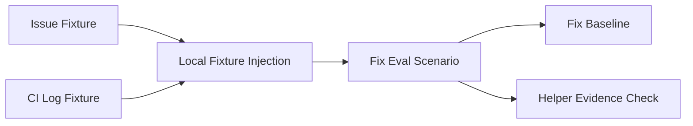

# Feature Specification: smithy.fix End-to-End Eval Scenario

**Spec Folder**: `2026-06-03-009-smithy-fix-end-to-end-eval-scenario`
**Branch**: `2026-06-03-009-smithy-fix-end-to-end-eval-scenario`
**Created**: 2026-06-03
**Status**: Draft
**Input**: `docs/rfcs/2026-001-token-savings/token-savings.rfc.md` — Milestone 1: deterministic smithy.fix end-to-end eval coverage.
**Source Feature Map**: `docs/rfcs/2026-001-token-savings/01-measurement-foundation.features.md` — Feature 1.4: smithy.fix End-to-End Eval Scenario.

## Clarifications

### Session 2026-06-03

- This specification targets the Dependency Order row `F3`, which corresponds to Feature 1.4 in the measurement-foundation feature map. `[Critical Assumption]`
- Feature 1.3a is the prerequisite token-baseline substrate; this feature consumes its token-aware baseline schema instead of redefining token extraction or comparison.
- The smithy.fix eval is offline and deterministic — no live GitHub issue, PR, or Actions APIs during scenario execution.
- Fixtures live at fixed locations: issue Markdown under `evals/fixture/issues/`, CI log text under `evals/fixture/ci-logs/`.
- Scenarios declare an issue fixture and a CI-log fixture; the runner exposes their paths to the invocation prompt so smithy.fix can run its error-description path offline.
- This feature does not edit `smithy.fix.prompt` (M3 owns CI-log prompt optimizations). The eval prompt names the local fixture paths and asks smithy.fix to diagnose them.

## Artifact Hierarchy

RFC -> Milestone -> Feature -> User Story -> Slice -> Tasks

## User Scenarios & Testing *(mandatory)*

### User Story 1: Provide Offline smithy.fix Fixtures (Priority: P1)

As a Smithy maintainer, I want a committed issue fixture and CI-log fixture for smithy.fix so that the eval can reproduce the high-cost failure path without network access.

**Why this priority**: The scenario cannot be deterministic until its GitHub issue and CI-log inputs are committed as local evidence.

**Independent Test**: Load the fixtures from the repository and verify they contain a fixable issue description, CI failure context, and enough file references for smithy.fix to diagnose the intended problem.

**Acceptance Scenarios**:

1. **Given** the eval fixture set is checked out, **When** the smithy.fix scenario loads its issue fixture, **Then** the fixture contains a concrete bug report or CI-failure description that can drive smithy.fix without `gh issue view`.
2. **Given** the eval fixture set is checked out, **When** the smithy.fix scenario loads its CI-log fixture, **Then** the fixture contains deterministic failing-test or build-output evidence that can drive diagnosis without `gh run view`.
3. **Given** a developer runs the eval offline, **When** fixture loading succeeds, **Then** no live GitHub issue, pull-request, or Actions API access is required to assemble the smithy.fix prompt.

---

### User Story 2: Run smithy.fix Against Local Failure Evidence (Priority: P1)

As a Smithy contributor, I want the eval runner to invoke smithy.fix with local issue and CI-log evidence so that the command follows its fix workflow in a repeatable fixture copy.

**Why this priority**: The user-facing value is end-to-end fix coverage, not just committed fixture files. The runner must place the local evidence into the scenario invocation in a stable way.

**Independent Test**: Run only the smithy.fix scenario against the reference fixture and verify the command consumes local fixture paths, produces a patch-oriented fix response, and does not require network credentials.

**Acceptance Scenarios**:

1. **Given** a smithy.fix scenario declares local issue and CI-log fixtures, **When** the runner builds the scenario invocation, **Then** the prompt includes stable references to those local fixture paths.
2. **Given** the scenario invocation includes local fixture paths, **When** smithy.fix executes in the temp fixture copy, **Then** it diagnoses the failure from the committed evidence instead of calling live GitHub commands.
3. **Given** GitHub credentials are absent, **When** the smithy.fix eval scenario runs, **Then** the scenario can still complete using only repository-local fixture evidence.

---

### User Story 3: Validate smithy.fix Output Structure and Helper Evidence (Priority: P1)

As a Smithy maintainer, I want structural and sub-agent checks for the smithy.fix eval so that regressions in the fix workflow are visible in the standard eval report.

**Why this priority**: A measured token count is useful only when paired with a quality signal that the command still performed the expected diagnosis and fix behavior.

**Independent Test**: Run the smithy.fix scenario and verify the report includes passing structural checks for diagnosis/fix/verification content plus helper evidence for the agents smithy.fix dispatches in this path.

**Acceptance Scenarios**:

1. **Given** smithy.fix completes against the offline fixtures, **When** structural validation runs, **Then** the output includes the expected diagnosis, fix action, and verification result markers for the scenario.
2. **Given** smithy.fix dispatches helper agents for this path, **When** sub-agent evidence validation runs, **Then** the report records passing evidence checks for each expected helper.
3. **Given** smithy.fix changes its wording while preserving the workflow, **When** validation runs, **Then** the checks rely on stable workflow markers and fixture-specific evidence rather than brittle full-output snapshots.

---

### User Story 4: Commit the smithy.fix Token-Aware Baseline (Priority: P1)

As a Smithy maintainer, I want a committed smithy.fix baseline in the token-aware schema so that downstream token-savings work can compare prompt changes against a known high-cost fix path.

**Why this priority**: M3's CI-log token-reduction work depends on a committed smithy.fix baseline from M1. Without it, later PRs cannot make credible token-delta claims.

**Independent Test**: Run the smithy.fix scenario after F1.3a lands, refresh its baseline, and verify a subsequent eval run reports both structural and token baseline checks.

**Acceptance Scenarios**:

1. **Given** the smithy.fix scenario has completed successfully, **When** its baseline is refreshed, **Then** the committed baseline records the structural expectations and token envelope for the scenario.
2. **Given** the committed smithy.fix baseline exists, **When** the scenario runs again within the token envelope, **Then** the eval report shows a passing baseline marker for the case.
3. **Given** a later prompt change materially increases tokens or breaks structure, **When** the scenario is compared to the baseline, **Then** the baseline checks expose the drift in the report.

### Edge Cases

- The CI-log fixture must exercise token-cost behavior while staying small enough for deterministic checkout and test runtime.
- Issue and CI-log fixtures can drift if edited independently; the scenario must fail clearly when required evidence is missing or inconsistent.
- A developer may run evals without GitHub credentials; missing credentials are not a scenario failure for this case.
- smithy.fix may choose a simple-fix path; assertions check diagnosis and verification behavior, not a specific implementation diff.
- If F1.3a's token-aware baseline schema changes during implementation, this feature consumes the landed schema rather than defining a competing one.

## Dependency Order

Recommended implementation sequence:

| ID | Title | Depends On | Artifact |
|----|-------|------------|----------|
| US1 | Provide Offline smithy.fix Fixtures | — | — |
| US2 | Run smithy.fix Against Local Failure Evidence | US1 | — |
| US3 | Validate smithy.fix Output Structure and Helper Evidence | US2 | — |
| US4 | Commit the smithy.fix Token-Aware Baseline | US3 | — |

## Requirements *(mandatory)*

### Functional Requirements

- **FR-001**: The system MUST include a committed offline issue fixture for the smithy.fix eval scenario.
- **FR-002**: The system MUST include a committed offline CI-log fixture for the smithy.fix eval scenario.
- **FR-003**: The smithy.fix eval scenario MUST be runnable without live GitHub issue, pull-request, or Actions API access.
- **FR-004**: The scenario definition MUST identify the local issue fixture and CI-log fixture needed for the invocation.
- **FR-005**: The runner MUST expose declared local fixture paths to the scenario invocation in a deterministic way.
- **FR-006**: The smithy.fix scenario prompt MUST direct the command to use the local fixture evidence rather than fetching live issue or CI data.
- **FR-007**: The scenario MUST validate stable structural markers for diagnosis, fix action, and verification output.
- **FR-008**: When the smithy.fix path exercised by the fixture dispatches helper agents, the scenario MUST validate the expected helper-agent evidence for each. If the observed offline path dispatches no helpers, the scenario MUST NOT require helper evidence (no fabricated or brittle dispatch patterns).
- **FR-009**: The scenario MUST fail clearly when a declared local fixture is missing, unreadable, or outside the allowed fixture area.
- **FR-010**: The scenario MUST leave the source fixture checksum invariant intact; any modifications happen only inside the runner's temp copy.
- **FR-011**: The system MUST commit a token-aware baseline for the smithy.fix scenario after the F1.3a baseline schema is available.
- **FR-012**: The committed baseline MUST preserve structural expectations and include a token envelope compatible with the F1.3a schema.
- **FR-013**: Unit tests MUST cover fixture declaration loading, local fixture path injection, missing-fixture failures, offline execution behavior, structural checks, helper evidence checks, and baseline loading for the smithy.fix scenario.

### Key Entities

| Entity | Shape | Relationships |
|--------|-------|---------------|
| Fix Eval Scenario | Scenario definition that invokes smithy.fix against committed local failure evidence. | Consumes Issue Fixture and CI Log Fixture via Local Fixture Injection; produces Fix Baseline. |
| Issue Fixture | Markdown fixture under `evals/fixture/issues/` containing the issue or CI-failure description used to seed smithy.fix. | Read by Fix Eval Scenario through Local Fixture Injection. |
| CI Log Fixture | Text fixture under `evals/fixture/ci-logs/` containing deterministic build or test failure output for the high-cost CI-log path. | Read by Fix Eval Scenario through Local Fixture Injection. |
| Local Fixture Injection | Runner contract that resolves scenario-declared fixture paths and exposes them to the invocation prompt. | Resolves Issue Fixture and CI Log Fixture; feeds Fix Eval Scenario. |
| Fix Baseline | Committed token-aware baseline for the smithy.fix scenario, conforming to the F1.3a schema. | Produced by a clean run of Fix Eval Scenario; consumed by later runs for comparison. |
| Helper Evidence Check | Sub-agent evidence assertion proving the expected smithy.fix helper path still ran. | Evaluated against Fix Eval Scenario output. |

## Assumptions

- Feature 1.3a lands before the smithy.fix baseline is committed, so this feature can consume the established token-envelope schema.
- The existing eval runner temp-copy model is sufficient for smithy.fix to edit files, run verification, and keep source fixtures unchanged.
- Prompt-level local fixture references are enough to exercise smithy.fix's error-description path without editing `smithy.fix.prompt`.
- The fixture should model the high-cost CI-log path that M3 will later optimize, but M3 owns the prompt changes that reduce CI-log token use.
- The expected helper-agent list is finalized from observed smithy.fix behavior at implementation time so the scenario checks the actual exercised path.

## Specification Debt

| ID | Description | Source Category | Impact | Confidence | Status | Resolution |
|----|-------------|-----------------|--------|------------|--------|------------|
| SD-001 | The exact helper-agent evidence set for the offline smithy.fix path is not known until the fixture is run against current smithy.fix behavior. The error-description path may dispatch no helpers at all. The implementation must record the observed helper path and choose stable evidence patterns from that output, or — if the run dispatches none — leave `sub_agent_evidence` empty rather than fabricating patterns. | Integration Points | Medium | Medium | open | — |
| SD-002 | The initial token envelope for the smithy.fix baseline cannot be calibrated until F1.3a's token-aware baseline schema is available and the scenario has a clean captured run. Implementers should choose a conservative initial envelope and document the captured totals in the implementation PR. | Non-Functional Quality | Medium | Medium | open | — |

## Out of Scope

- Editing `smithy.fix.prompt` to change CI-log handling or reduce token usage.
- Implementing the M3 CI-log failure-extraction grep or build-output protocol changes.
- Live GitHub issue, PR review, or Actions log integration inside this eval scenario.
- New eval scenarios for smithy.forge, JVM fixtures, or planning commands.
- Per-sub-agent token attribution or per-agent token baselines.
- Refreshing `.claude/` or `.smithy/` deployed snapshots.

## Success Criteria *(mandatory)*

### Measurable Outcomes

- **SC-001**: A committed smithy.fix eval scenario runs from local issue and CI-log fixtures without GitHub credentials.
- **SC-002**: Missing or invalid local fixture declarations produce clear scenario-loading or runner errors.
- **SC-003**: The eval report includes structural pass/fail checks for the smithy.fix scenario's diagnosis, fix, and verification markers.
- **SC-004**: When the observed smithy.fix path dispatches helpers, the eval report includes helper evidence checks for them; when it dispatches none, the report records no helper checks rather than failing.
- **SC-005**: A token-aware `fix-from-issue` baseline is committed and passes against a clean scenario run.
- **SC-006**: Unit tests cover the scenario loader, runner fixture injection, offline scenario behavior, validation checks, and baseline compatibility paths.
